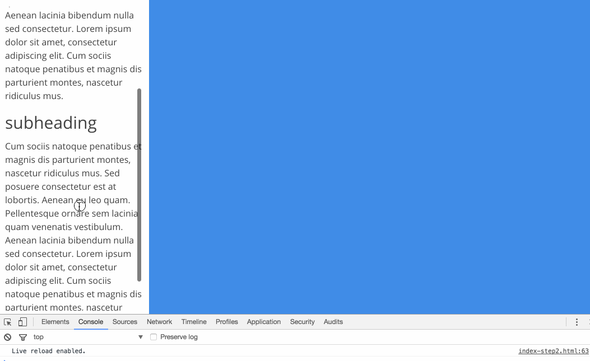
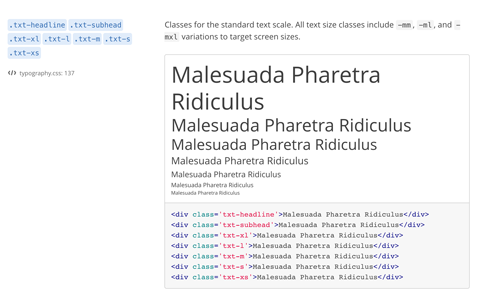
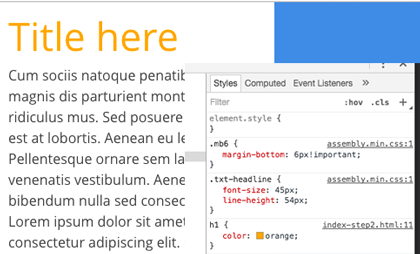
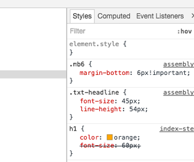
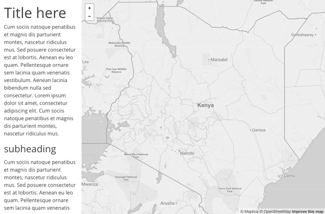
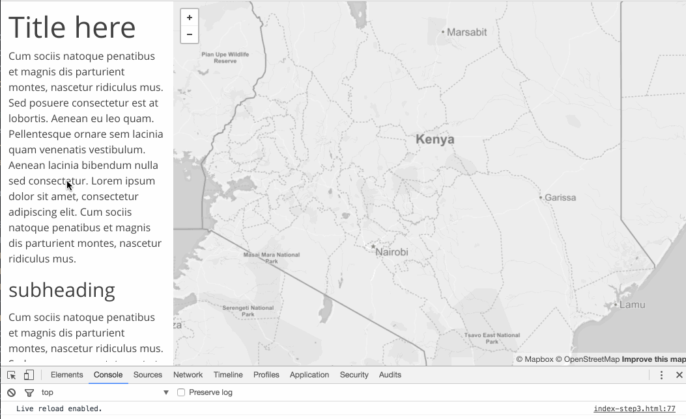
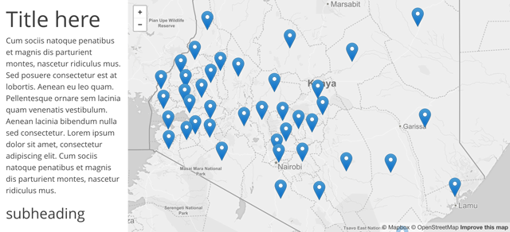
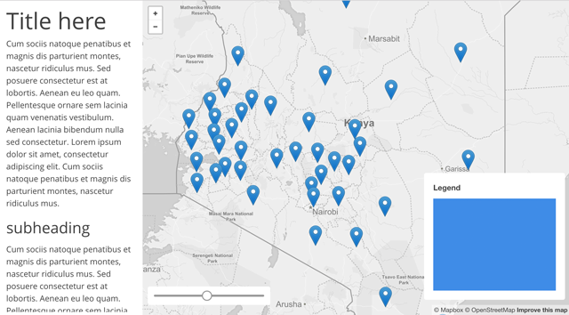

# Lab 04: Implementing the User Experience

## TOC

* [Part I: Building a responsive web document (8 pts)](#part-i-building-a-responsive-web-document-8-pts)
  * [Using Mapbox\.js and Omnivore to load our mapping resources](#using-mapboxjs-and-omnivore-to-load-our-mapping-resources)
  * [Understanding the Mapbox\.js API](#understanding-the-mapboxjs-api)
  * [loading data into the app](#loading-data-into-the-app)
  * [adding UI and legend elements to our map](#adding-ui-and-legend-elements-to-our-map)
  * [Moving custom CSS and JS to external files\.](#moving-custom-css-and-js-to-external-files)
* [Part II: Reflecting on User Centered Design (2 pts)](#part-ii-reflecting-on-user-centered-design-2-pts)

## Part I: Building a responsive web document (8 pts)

**Instructions:** Build your *index.html* and file/directory structure according to the instructions detailed below. Note that you'll have needed to produced the *kenya_education_2014.csv* file per the lesson instructions and saved within a *lab-04/data/* directory.

Before we get started actually coding our map, or getting the data into the application, we want to start with a basic HTML boilerplate. This isn't something we need to recall from memory or write from scratch. Rather, we either keep a boilerplate ready, copy and paste the markup from a previous project, or grab it from an example on the web. While it's most efficient in terms of your workflow to keep a boilerplate handy, occasionally you'll want to revisit this as advancements in the web specifications change (as they recently did in a big shift from HTML4 to HTML5).

One challenge for web designers is effectively building a web page or application that works well across all browsers as well as device sizes (desktop computers, tablets, mobile, etc). Writing all the CSS rules yourself can be challenging. Designers therefore use CSS frameworks (sometimes called skeletons or boilerplates) to help. Often these frameworks make use of a "grid" layout, which helps organize and vertically align elements within the page, as well as to "responsively" adapt to the width of a device. Read more about [Responsive Web Design Grid-view](http://www.w3schools.com/css/css_rwd_grid.asp).

Within this lesson, we're going to explore just such a framework, currently being developed by Mapbox. It's called [Assembly.css](https://www.mapbox.com/assembly/).

We'll begin with the ["Getting Started"](https://www.mapbox.com/assembly/) section from the Assembly CSS documentation. They provide an HTML template which includes the links to load the CSS and JavaScript files required by Assembly.

Create a new `index.html` file within your `lab-04` directory.

```html
<!DOCTYPE html>
<html lang='en'>
<head>
  <title><!-- Your title goes here --></title>
  <meta charset='utf-8'>
  <meta name='viewport' content='width=device-width, initial-scale=1'>
  <link rel='shortcut icon' href='Your favicon path goes here' type='image/x-icon'>
  <link href='https://api.mapbox.com/mapbox-assembly/v0.8.0/assembly.min.css' rel='stylesheet'>
  <script async defer src='https://api.mapbox.com/mapbox-assembly/v0.8.0/assembly.js'></script>
</head>
<body>
  <!-- Your page... -->
</body>
</html>
```

This should be a somewhat familiar document to you. Next,

* update the title of the document
* remove the `<link rel='shortcut icon' href='Your favicon path goes here' type='image/x-icon'>` unless you want to add a favicon image

Let's now plug in some HTML and consider how Assembly.css works to style our page for us. Cut and paste the following HTML, borrowed and modified from [this Assembly.css example](https://www.mapbox.com/assembly/examples/sidebar-apps/), into the body of your document.

```html
<div class='grid'>
    <div class='col col--12 col--3-ml p12 pb6 viewport-third viewport-full-ml'>
        <div class='h-full scroll-auto'>
            <h1 class='txt-headline mb6'>Title here</h1>
            <p>Cum sociis natoque penatibus et magnis dis parturient montes, nascetur ridiculus mus. Sed posuere consectetur est at lobortis. Aenean eu leo quam. Pellentesque ornare sem lacinia quam venenatis vestibulum. Aenean lacinia bibendum nulla sed consectetur. Lorem ipsum dolor sit amet, consectetur adipiscing elit. Cum sociis natoque penatibus et magnis dis parturient montes, nascetur ridiculus mus.</p>
            <h2 class='txt-xl mt18 mb12'>subheading</h2>
            <p>Cum sociis natoque penatibus et magnis dis parturient montes, nascetur ridiculus mus. Sed posuere consectetur est at lobortis. Aenean eu leo quam. Pellentesque ornare sem lacinia quam venenatis vestibulum. Aenean lacinia bibendum nulla sed consectetur. Lorem ipsum dolor sit amet, consectetur adipiscing elit. Cum sociis natoque penatibus et magnis dis parturient montes, nascetur ridiculus mus.</p>
            <footer class='mt12 bg-gray-faint txt-s'>
                <ul>
                    <li>Explore the raw <a class='link' href='#'>data</a></li>
                    <li>Map authored by <a class='link' href='#'>Ptolemy</a></li>
                    </p>
            </footer>
        </div>
    </div>
    <div class='col col--12 col--9-ml h180 h-full-ml'>
        <div id="map" class='viewport-twothirds viewport-full-ml bg-blue'></div>
    </div>
</div>
```

Saving these changes and testing the file in your browser reveals a nicely formatted, scrollable side column at left, with some footer information at the bottom. To the right we have a placeholder for our map, currently with a background color of blue.

  
**Figure 02.** Basic one-column page layout with Assembly.css.

How does Assmembly.css work to apply style rules to these elements? You'll notice that most of the elements in the example have many class attribute values, separated by a space (e.g., `<div class='col col--12 col--3-ml p12 pb6 viewport-third viewport-full-ml'>`). Rather than writing all the CSS rules ourselves, we can rely on Assembly's many class definitions help style the layout of the page, positioning of elements, typography, margin and padding around elements, and all the other presentational aspects governed by CSS.

Let's look at an example. Consider the h1 heading element: `<h1 class='txt-headline mb6'>Title here</h1>`. There are two classes applied to this element, `txt-headline` and `mb6`. These aren't standard class names, but they were invented by the people who wrote Assembly.css. To know what they are and how to modify them, we need to consult the [documentation](https://www.mapbox.com/assembly/documentation/) (you can Cntr+F to search for a specific class name within the docs, or search using the navigation).

  
**Figure 01.** Assembly.css documentation of Typography.

We see that [the `txt-headline` class](https://www.mapbox.com/assembly/documentation/#Typography) is one of several classes for the "standard text scale." Other classes that scale the text size include:

```css
.txt-headline { }
.txt-subhead { }
.txt-xl { }
.txt-l { }
.txt-m { }
.txt-s { }
.txt-xs { }
```

Try changing the class `txt-headline` class on the h1 element to one of these other options to see the results in your browser.

Note that the documentation also links you directly to [the actual CSS rules in Assembly that governs that style rule](https://github.com/mapbox/assembly/blob/0.8.0/src/typography.css#L137). You can see that these are nothing special: just rules like `font-size: 45px;` and `line-height: 54px;`.

The second class rule applied to our h1 heading is `mb6`, which isn't very helpful or descriptive. We again need to [dig into the documentation](https://www.mapbox.com/assembly/documentation/#Margins) to make sense of this class rule, which gives the element a bottom-margin of 6.

These class names are not intuitive, and the tradeoff of using a CSS framework such as Assembly.css is that you must study and remember an abstract set of class names that are not necessarily intuitive and usually aren't applied to other frameworks. The benefit is, once you master the framework and apply it to a project, you'll like have a consistent display across browsers and devices and can develop more quickly than writing all your own rules.

Additionally, you can override the Assembly.css rules with your own. To do so, let's add our familiar `<style></style>` tags to the head of the document and write some custom CSS. For instance, we can still select the h1 header and try applying a `color` rule:

```html
<style>
    h1 {
        color: orange;
    }
</style>
```

Applying this rule results in:

  
**Figure 02.** Overriding Assembly.css rule with custom CSS rule.

We can see see the title is now orange. If we inspect the CSS inheritance in the web dev tools, our rule is now visible, but note how .mb6 and .txt-headline still override our h1 rule for their stated rules. Attempting to add a `font-size` rule to our h1 select will be overwritten by the Assembly.css rule.

  
**Figure 03.** Assembly.css overriding custom rule of font-size.

 You can sometimes override an Assembly.css rule with `!important`, but many of Assembly's rules also use this to ensure the grid layout doesn't break inadvertently.

 You should take some more time to explore the Assembly.css documentation to style elements within your page.

So far we haven't armed this web page with the code needed to do our web mapping. Let's turn to that next, and get a basic slippy map loaded in the page.

### Using Mapbox.js and Omnivore to load our mapping resources

For this map we're going to be using [Mapbox.js](https://www.mapbox.com/mapbox.js/) as our mapping library. Mapbox.js is  built upon Leaflet.js. Consider it a "wrapper" for Leaflet.js, which extends Leaflet's functionality. That is to say, the methods, options, and events that are available through the [Leaflet API](http://leafletjs.com/reference.html) are all available within the Mapbox.js library as well.

Much like [Leaflet's many useful plugins](http://leafletjs.com/plugins.html), there are additional [plugins for Mapbox.js](https://www.mapbox.com/mapbox.js/plugins/) that extend its functionality.

If you don't already have an account with Mapbox, you'll want to sign up for one and request the [upgrade to the Mapbox Standard account](https://www.mapbox.com/help/nonprofit-student-plan/) as a student. You'll need to obtain this account and an access key for using Mapbox.js below.

We're also going to explore an alternative technique for getting our data loaded into the map using [Mapbox leaflet-omnivore](https://github.com/mapbox/leaflet-omnivore), a plugin built to be used with Leaflet/Mapbox.

To begin our scripting for this map, you'll need to obtain your [API access token](https://www.mapbox.com/studio/account/tokens/) from Mapbox and enter it as a String value for the property `L.mapbox.accessToken`. If you're logged into your Mapbox account, they've dynamically entered your access token for you on the  [a simple map](https://www.mapbox.com/mapbox.js/example/v1.0.0/) page, so you can simply cut and paste from there (and even use that code bank as a future HTML template when starting a project). You can also copy the link paths to load Mapbox.js and Mapbox.css into your document from this example, or simply from the [Mapbox.js page](https://www.mapbox.com/mapbox.js/api/v3.0.1/).

```html
<script src='https://api.mapbox.com/mapbox.js/v3.0.1/mapbox.js'></script>
<link href='https://api.mapbox.com/mapbox.js/v3.0.1/mapbox.css' rel='stylesheet' />
```

Once we have the Mapbox resources available to us, create our familiar `<script></script>` tags at the bottom of our document, before the closing body tag. Note that I've moved the requests for Assembly.js and Mapbox.js to the bottom of the document as well.

```html
<script async defer src="https://api.mapbox.com/mapbox-assembly/v0.7.0/assembly.js"></script>
<script src='https://api.mapbox.com/mapbox.js/v3.0.1/mapbox.js'></script>
<script
<script>
L.mapbox.accessToken = '< your access token here>';
var map = L.mapbox.map('map', 'mapbox.streets')
    .setView([40, -74.50], 9);
</script>
</body>
</html>
```

Save these changes and then test the file in your browser (using a local host server, of course).

We see that the map has been centered on the city Philadelphia at a zoom level of 9. Note that we're loading a tileset provided by Mapbox. This is designated by the `mapbox.streets` within the `L.mapbox.map()` method call. The [Mapbox maps API offers a variety of basemaps](https://www.mapbox.com/developers/api/maps/) for use within a Mapbox.js-enabled map. Feel free to explore these various base maps.

Let's change these latitude/longitude coordinates to center it within Kenya (-.23, 37.8). We'll also want to adjust the zoom level to fit within our browser window (6 or 7), and perhaps set some maximum bounds around our geographic area of interest. Also change the basemap to be `mapbox.light`, which is more suitable for thematic mapping than the `mapbox.streets` tiles.

```javascript
var map = L.mapbox.map('map', 'mapbox.light', {
    zoomSnap: .1,
    center: [-.23, 37.8],
    zoom: 7,
    minZoom: 6,
    maxZoom: 9,
    maxBounds: L.latLngBounds([-6.22, 27.72],[5.76, 47.83])
});
```

The basemap and its design is an important consideration and one perhaps left until later in our process (more within Garrett's surface plane, even). Fortunately, a different basemap can easily be swapped in later on.

  
**Figure 04.** Web Page with Mapbox map loaded.

Before we introduce ourselves to the Mapbox API and begin coding our map to load and display the data, let's point out one cool feature of our current layout design.

Within your web developer toolbar there is an option to "Toggle Device Toolbar." Clicking on this allows you resize the viewport responsively (i.e., dragging the viewport wider and taller). There are also some presets approximating some specific devices (e.g., iPhone, iPad). If we adjust the size of the viewport, we see that when it becomes more narrow, it crosses a particular "breakpoint" where the layout changes to stack the side column at left on top of the map.

  
**Figure 05.** Responsive layout.

How do the CSS rules? Assembly.css is a "mobile first" approach to CSS web design. CSS rules governing such properties as width and positioning are first applied universally assuming we're designing for a small mobile device. Then, if the width of the screen is a certain width or wider, we change the rule using what's known as a [CSS media query](https://developer.mozilla.org/en-US/docs/Web/CSS/Media_Queries/Using_media_queries).

For instance, let's consider the rule for the division element with the id attribute of "map": `<div id="map" class='viewport-twothirds viewport-full-ml'></div>`. We see the class `viewport-twothirds` is applied to the element, which makes our map the height of the viewport 2/3 of the screen. This is followed by another class `viewport-full-ml`. The `-ml` class applies only when the viewport is a large screen and allows the map to fill the full height of the screen. Consulting the documentation, you can see that you can target many of Assembly's rules with `-mm, -ml, and -mxl` variations to target screen sizes.


### Understanding the Mapbox.js API

Like Leaflet, and many other JavaScript libraries, [the Mapbox.js API is well-documented](https://www.mapbox.com/mapbox.js/api/). You should take some time to scan through this documentation to get a sense of the extended functionality Mapbox.js provides to Leaflet.js. Again, what's key here is that Mapbox.js was built on top of Leaflet.js.

For example, we see that beyond, Leaflet Mapbox.js offers such functionality as the [L.mapbox.geocoder](https://www.mapbox.com/mapbox.js/api/v3.0.1/l-mapbox-geocoder/), which offers a geocoding and reverse-geocoding service.

Read documentation of the [`L.mapbox.map()`](https://www.mapbox.com/mapbox.js/api/v3.0.1/l-mapbox-map/) method, which creates and configures a map with layers. The only difference in how the method is written is the addition of  `mapbox` between the `L.map`. Like `L.map`, as [documented within Leaflet's API reference](http://leafletjs.com/reference.html#map-constructor), this method refers to a `<div>` element with the `id` attribute of "map" and references a set of tiles to be served remotely.

A third optional argument is an object of options. Importantly, Mapbox says, "If provided, it is the same options as provided to L.Map with the following additions." This means we can use all of Leaflet's options in here as well. For example, we can [set minimum and maximum zoom levels of the map and enable dragging](https://www.mapbox.com/mapbox.js/api/v3.0.1/l-map-class/).

### loading data into the app

Next let's get our Kenyan primary school data into the map. We've encoded the point-level schools data within a CSV file. As you remember, in a previous module we used a JavaScript library named [PapaParse](http://papaparse.com/) to asynchronously load the CSV data into our script.

When using Mapbox.js, we can make use of a plugin named [Leaflet Omnivore](https://www.mapbox.com/mapbox.js/plugins/#leaflet-omnivore), which loads and parses a variety of data formats and converts them into a Leaflet GeoJson layer. The plugin has its own [leaflet-omnivore](https://github.com/mapbox/leaflet-omnivore) GitHub repository with further documentation.

First we need to include the plugin within our web page, and then can try implementing it using our `keyna_education_2014` data. At the bottom of our document, **after we load the Mapbox.js script**, let's load the Omnivore code.

```javascript
<script src='https://api.mapbox.com/mapbox.js/plugins/leaflet-omnivore/v0.2.0/leaflet-omnivore.min.js'></script>
```

Then, drawing from the [Leaflet Omnivore example](https://www.mapbox.com/mapbox.js/example/v1.0.0/markers-from-csv/), we can first try loading the data and adding it to the map using the statement:

```javascript
omnivore.csv('data/kenya_education_2014.csv').addTo(map);
```

  
**Figure 06.** CSV data loaded with Omnivore and added to map as Leaflet GeoJson layer.

With the inclusion of this one statement it appears we've successfully loaded the data and drawn them on the map as the default Leaflet markers! Omnivore handled the AJAX request for the file and parsed it as Leaflet GeoJson layers, and the method call `addTo(map)` plotted our data to the map as simple Leaflet markers.

However, if there happens to be an error in the CSV data or a problem parsing it, Omnivore doesn't by default throw us a useful error. As the documentation for the [Leaflet Omnivore](https://github.com/mapbox/leaflet-omnivore) warns us:

> Each function returns an `L.geoJson` object. Functions that load from URLs are asynchronous, so they will not immediately expose accurate `.setGeoJSON()` functions.
>
>For this reason, we fire events:  
> * `ready :` fired when all data is loaded into the layer
> * `error: ` fired if data can't be loaded or parsed

```javascript
var layer = omnivore.gpx('a.gpx')
.on('ready', function() {
    //  all data is loaded into the layer
})
.on('error', function() {
    // fired if the layer can't be loaded over AJAX
    // or can't be parsed
})
.addTo(map);
```
It's a good idea to use some error catching technique when you can, especially when dealing with asynchronous calls. Therefore, let's modify our script using this example.

```javascript
omnivore.csv('kenya_education_2014.csv')
    .on('ready', function(e) {
        console.log(e.target)
    })
    .on('error', function(e) {
        console.log(e.error[0].message);
});
```

Here we see that we're making use of the `e` parameter created within each callback function. In the case of the `.on('ready' .. )` method callback function, e.target will give us access to the resultant Leaflet GeoJson LayerGroup layer. The  `e` parameter created within `.on('error' .. )` method gives us access to any errors the script reports.

By using `console.log(e.target)` we have access to the Leaflet GeoJson LayerGroup, knowing that the data has been properly loaded and ready for further use within our script.

### adding UI and legend elements to our map

Before we wrap up, let's add some anticipated HTML elements to our document: 1. a division element that can hold our legend, and 2. an input range slider for eventually sequencing through our data attributes, also wrapped in a division element.

Modify the HTML in your document to add both of these `slider` and `legend` elements (note I've included more Assembly.css classes on these elements):

```html
<div class='col col--12 col--9-ml h180 h-full-ml'>
    <div id="map" class='viewport-twothirds viewport-full-ml'></div>

    <!-- ui slider -->
    <div id='slider' class='range w240 bg-white round-ml p12'>
        <input type='range' />
    </div>

    <!-- legend -->
    <div id='legend' class='bg-white round-ml p18'>
        <h3 class='txt-bold mb12 w-full mx-auto'>Legend</h3>
        <div class='bg-blue h180 w240 mx-auto'></div>
    </div>
</div>
```

Here I'm simply creating a blue box as a placeholder for the future proportional symbol legend.

Next, we'll use some familiar Leaflet methods to "get" or select these elements and add them to the map. Add the following JavaScript to do this (above our Omnivore call to load the data but below the statements that create the map):

```javascript
// create Leaflet control for the legend
var legend = L.control({
    position: 'bottomright'
});

legend.onAdd = function(map) {

    var div = L.DomUtil.get("legend");

    L.DomEvent.disableScrollPropagation(div);
    L.DomEvent.disableClickPropagation(div);

    return div;

}

legend.addTo(map);

// create Leaflet control for the slider
var sliderControl = L.control({
    position: 'bottomleft'
});

sliderControl.onAdd = function(map) {

    var controls = L.DomUtil.get("slider");

    L.DomEvent.disableScrollPropagation(controls);
    L.DomEvent.disableClickPropagation(controls);

    return controls;

}

sliderControl.addTo(map);
```

This code creates L.Control objects, selects our respective HTML elements, and adds them to the map (disabling scrolling or clicking on the map underneath them).

  
**Figure 07.** HTML elements added to the map as L.Controls.

We now have a responsive layout for our web page and are loading data into the map!

### Moving custom CSS and JS to external files.

To wrap up, we'll made a couple modifications to our file/directory structure. It's often convenient to start development with the CSS, HTML, and JS all within the *index.html* file. We've been doing this so far in New Maps Plus, writing our CSS rules within the head of the document between the `<style></style>` tags and the JS at the bottom between the `<script></script>` tags.

However, at some point before you release the productive version of the document, you'll want to move these to external files. You've likely noticed that we're starting to keep data files in a directory called *data/* and link to these files using a relative path (e.g., `data/kenya_education_2014.csv`). We'll do the same for our CSS and JS now.

To do this, create two new directories within the *lab-03/* directory and name them *js/* and *css/*. Then, create a file named *app.js* within the *js/* directory and a file named *styles.css* within the *css/* directory.

Open the *app.js* file in your text editor and begin by writing the following JS within the blank file:

```javascript
(function(){

    // application code goes here

})();
```

This is an anonymous, self-invoking function that will execute once the document has loaded and all the resources are available.

Next, cut and paste all the JS we've written so far from the *index.html* file and paste it into the body of this function. Then, give the now empty script tags a `src` attribute value of a relative path to the new file: `<script src='js/app.js'></script>`. Save the files and test in the browser to ensure the paths are correct and the page loads as before.

While we haven't written any custom CSS rules, other than testing to see if we can change the title to orange, we can do the same thing with our CSS file, again linking to this local file in the same way as well request and load the other external resources: `<link href='css/styles.css' rel='stylesheet' />.`

Your final file/directory structure should then look like this (with empty `<style></style>` and `<script></script>` tags in the document, linking to these files):

```text
- lab-03/
  - index.html
  - css/
    - styles.css
  - js/
    - app.js
  - data/
    - kenya_education_2014.csv
  - graphics/ (images used in the lab.md file)
  - lab-04.md (the lab instructions)
  - reflection.md (from part II below)
  - mockup.png (from part II below)
```

## Part II: Reflecting on User Centered Design (2 pts)

Create a new file named *reflection.md* within your *lab-04/* directory and provide a short answer response (2 - 3 sentences) to each of the following questions. This is a Markdown file, and you'll be writing plain text or Markdown.

1. Given the discussion of the user experience and usability in the lesson, think of a design that you've encountered (either a material object in the world or a digital interface) that you found frustrating or confusing. Discuss your experience using it in terms of *Figure 03. User motivation vs Interface Complexity* from the lesson.
2. Garrett begins his process of working through the "elements of the user experience" by asking the "why should we make this product?", before moving on to build it. Consider a map you'd like to hypothetically create (just imagine that you can get the data you need for it) and answer these two questions:
    1. What do we want to get out of this product?
    2. What do our users want to get out of it?
3. Create a low-fidelity wireframe or mockup of the map you're imagining in question 02. Feel free to draw by hand and scan or take picture of, or use a computer or web-based application, to produce a digital image of this wireframe/mockup. Name the file something like *mockup.png* and add/commit this image to your *lab-04/* directory.

Commit and save your changes to the *reflection.md* file, along with all the other files, and submit with a URL link to your repository via Canvas assignment by the due date.
